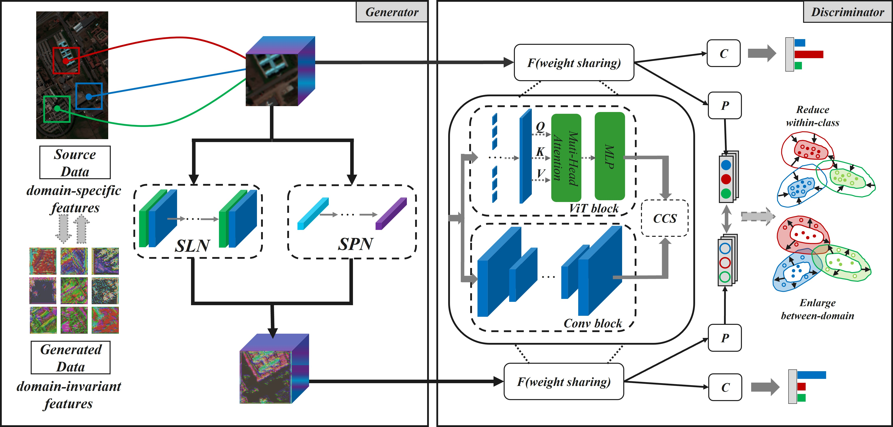

# Domain-Adversarial Generative and Dual Feature Representation Discriminative Network for Hyperspectral Image Domain Generalization.

You can access the paper [here](https://ieeexplore.ieee.org/document/10695100 "Access the paper").


## Abstract

Traditional training models often suffer significant performance drops on test sets when there is a discrepancy between the distributions of the training and testing data. To address this domain shift issue, we propose D3Net, a domain generalization (DG) classification network for hyperspectral images (HSIs) based on generative adversarial networks (GANs). D3Net primarily consists of a generator and a discriminator. The generator extracts domain-invariant information from the source domain to generate data with essential classification features. The discriminator employs a dual-confidence model to better capture domain-invariant features. Through adversarial training, the model adapts to domain shifts encountered with unknown data. Unlike existing DG methods, which rely on random perturbations for data augmentation, D3Net utilizes learnable convolutional neural networks (CNNs) to enhance the model’s learning capability. We conducted cross-scene classification experiments using datasets from Houston, Pavia, and Indiana, and the results demonstrate the effectiveness of our approach. The code for D3Net is available at: https://github.com/gmsjzyq123/D3Net.

## Citation
To cite this paper, use the following format:
```
@ARTICLE{10695100,
  author={Chu, Minghui and Yu, Xiaodong and Dong, Hongbin and Zang, Shuying},
  journal={IEEE Transactions on Geoscience and Remote Sensing}, 
  title={Domain-Adversarial Generative and Dual-Feature Representation Discriminative Network for Hyperspectral Image Domain Generalization}, 
  year={2024},
  volume={62},
  number={},
  pages={1-13},
  keywords={Hyperspectral imaging;Data models;Feature extraction;Generators;Training;Generative adversarial networks;Adaptation models;Contrastive learning;domain generalization (DG);generative adversarial network (GAN);hyperspectral image (HSI) classification},
  doi={10.1109/TGRS.2024.3468311}}
```
## Datasets

The following datasets are used for experiments:

- **Houston**: Contains hyperspectral images from the Houston area, including various land cover types. Files:
  - `Houston13.mat`: Dataset for Houston13.
  - `Houston13_7gt.mat`: Ground truth data for Houston13.
  - `Houston18.mat`: Dataset for Houston18.
  - `Houston18_7gt.mat`: Ground truth data for Houston18.

- **Pavia**: Includes hyperspectral images from the Pavia region, commonly used for classification. Files:
  - `paviaC.mat`: Dataset for Pavia Center.
  - `paviaC_7gt.mat`: Ground truth data for Pavia Center.
  - `paviaU.mat`: Dataset for Pavia University.
  - `paviaU_7gt.mat`: Ground truth data for Pavia University.

- **Indiana**: Contains hyperspectral images from the Indiana region.

File Structure:
```
datasets
├── Houston
│   ├── Houston13.mat
│   ├── Houston13_7gt.mat
│   ├── Houston18.mat
│   └── Houston18_7gt.mat
└── Pavia
│   ├── paviaC.mat
│   └── paviaC_7gt.mat
│   ├── paviaU.mat
│   └── paviaU_7gt.mat
└── Indiana
```
   
